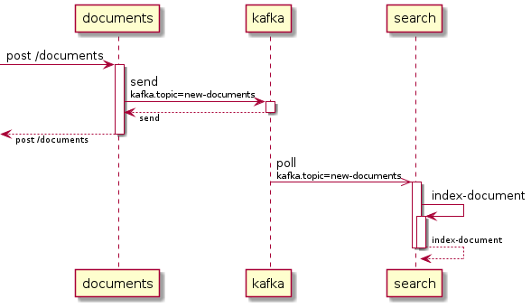

<!-- build-status -->
[](https://travis-ci.com/github/remal/tracing-spec)
[](https://maven-badges.herokuapp.com/maven-central/name.remal.tracing-spec/tracing-spec-application)

[](https://sonarcloud.io/dashboard?id=name.remal.tracing-spec%3Atracing-spec)
[](https://sonarcloud.io/dashboard?id=name.remal.tracing-spec%3Atracing-spec)
* [](https://sonarcloud.io/dashboard?id=name.remal.tracing-spec%3Atracing-spec)
[](https://sonarcloud.io/dashboard?id=name.remal.tracing-spec%3Atracing-spec)
* [](https://sonarcloud.io/dashboard?id=name.remal.tracing-spec%3Atracing-spec)
[](https://sonarcloud.io/dashboard?id=name.remal.tracing-spec%3Atracing-spec)
* [](https://sonarcloud.io/dashboard?id=name.remal.tracing-spec%3Atracing-spec)
[](https://sonarcloud.io/dashboard?id=name.remal.tracing-spec%3Atracing-spec)
<!--/ build-status -->

# TracingSpec

<!-- description -->


Sometimes you have really complex business scenarios with a lot of different services involved. You can write documentation manually, but there are some problems here.

The documentation should be maintained, which is hard in active development stage of the project.

How to validate it?

This projects helps to solve such problems by handling data from distributed tracing system (e.g. [Zipkin](https://zipkin.io/), [Jaeger](https://www.jaegertracing.io/)) and providing visualization and validation functionality

<br clear="left">
<!--/ description -->

## Example scenario

We send a new document to `documents` service via REST API. Then `documents` services publishes some notification to a Kafka topic. Then `search` service consumes such notifications and indexes upload documents.

In this scenario we except having these flow: 

Additional conditions:
* Our distributed tracing system is [Jaeger](https://www.jaegertracing.io/)
* Our tests on CI are integrated with the Jaeger instance

Configure TracingSpec application by creating this `application.yml` file:
```yaml
tracingspec:
  retriever:
    jaeger:
      host: jaeger-query-host # place here your Jaeger Query service hostname
  renderer:
    options:
      graph-processors:
      - replace-single-root-with-children # We replace single root span with its children. You can find motivation below.
      node-processors:
      - append-server-to-client # Usually for REST API calls we have two spans: client and server as a child, let's merge them
      - set-kafka-remote-service-name-from-tag # Jaeger doesn't handle removeServiceName, so here we use a special processor that sets removeServiceName for spans with 'kafka.topic' tag
      - js: # For this scenario we aren't interested in children of 'index-document' span of 'search' service, let's remove its children using JavaScript processor
          script: |
            if (node.serviceName == 'search' && node.name == 'index-document') {
                node.clearChildren()
            }
      tags-to-display:
      - kafka.topic # We'd like to render this tag
```

Create this `expected.yml` file:
<!-- include-yaml: example-graph.yaml -->
```yaml
- name: post /documents
  serviceName: documents
  children:
  - name: send
    serviceName: documents
    remoteServiceName: kafka
    kind: producer
    tags:
      kafka.topic: new-documents
    children:
    - name: poll
      serviceName: search
      remoteServiceName: kafka
      kind: consumer
      tags:
        kafka.topic: new-documents
      children:
      - name: index-document
        serviceName: search
```
<!--/ include-yaml -->

Send an HTTP request to `documents` service from your CI service (that is integrated with the Jaeger instance). This HTTP request should be sent inside a new span:
```java
// tracer - an instance of brave.Tracer
ScopedSpan scopedSpan = tracer.startScopedSpan("test");
String traceId = testSpan.context().traceIdString();
try {
    // documentsServiceClient - an instance of HTTP client to documents service
    // document - document to save
    documentsServiceClient.saveNewDocument(document);
} finally {
    testSpan.finish();
}
// now you can use traceId for further actions
```

Why do we start a new trace here, in test? To retrieve trace ID. Other way can be to return trace ID from `documents` service in HTTP headers and parse them.

As we create a new trace inside the test, our trace has redundant root span with name equals to `test`. We aren't interested in this span, that's why we added `replace-single-root-with-children` graph processor to `application.yml`.

Let's check that our services work correctly. Execute `java -jar tracing-spec-app.jar match <traceId> expected.yml`. This command will load spans for the trace for our Jaeger instance and will check if they match to `expected.yml` file.

If everything works fine, we'd like to place a PlantUML diagram to our documentation.

We can place there a diagram of actual spans for our trace by executing `java -jar tracing-spec-app.jar render-trace <traceId> plantuml-sequence diagram.puml`.

Or we can render `expected.yml` file itself by executing `java -jar tracing-spec-app.jar render-graph expected.yml plantuml-sequence diagram.puml`. For example, diagram that you can find above is generated by exactly this command.

## Documentation

Download [tracing-spec-app.jar](https://github.com/remal/tracing-spec/releases/latest/download/tracing-spec-app.jar) and use it as a general Spring Boot application.

### Configuration

The application should be configured using [Spring Boot Externalized Configuration feature](https://docs.spring.io/spring-boot/docs/current/reference/html/spring-boot-features.html#boot-features-external-config).

Spring properties a listed [below](#spring-properties).

### Usage

Current renderer names:
* `plantuml-sequence` - [plantuml sequence diagram](https://plantuml.com/sequence-diagram)
* `json` - JSON
* `yaml` - YAML

#### Render trace

Command: `java -jar tracing-spec-app.jar render-trace <traceId> <rendererName> <outputFile>`
* `traceId` - Trace ID
* `rendererName` - Renderer name
* `outputFile` - Output file path

#### Render graph

Command: `java -jar tracing-spec-app.jar render-graph <graphFile> <rendererName> <outputFile>`
* `graphFile` - Pattern graph file (YAML/JSON/JSON5)
* `rendererName` - Renderer name
* `outputFile` - Output file path

#### Match

Command: `java -jar tracing-spec-app.jar match <traceId> <patternGraphFile>`
* `traceId` - Trace ID
* `patternGraphFile` - Pattern graph file (YAML/JSON/JSON5)
* Optional parameters:
  * `--attempts=<number>` - Number of attempts to retrieve spans and match them
  * `--attempts-delay=<number>` - Delay between attempts, in milliseconds

Pattern graph file can look like this (YAML):
```yaml
- name: post /resource # span name equals to 'post /resource'
  serviceName: /(\w+-)?service/ # service name matches to '(\w+-)?service' regex
  kind: CLIENT # span kind, can be one of: CLIENT, SERVER, PRODUCER, CONSUMER
  children:
  - # name is not set, so tested span can have any
    async: true # span is marked as an async on, of its kind equals to CONSUMER
    serviceName: service # service name equals to 'service'
    remoteServiceName: kafka # remote service name equals to 'kafka'
    tags:
      topic: notification # span should have a tag with name equals to 'topic' and value equals to 'notification'
```

Every string value in pattern file can be a regex. If a string value is `/[regex]/i`, this pattern will be used for matching:
```java
Pattern.compile("[regex]", CASE_INSENSITIVE | UNICODE_CASE | UNICODE_CHARACTER_CLASS)
```

These regex modifiers are supported:
* `d` - `UNIX_LINES`
* `i` - `CASE_INSENSITIVE`
* `x` - `COMMENTS`
* `m` - `MULTILINE`
* `s` - `DOTALL`

`UNICODE_CASE` and `UNICODE_CHARACTER_CLASS` modifiers are added to all regexps.

### Spring properties

#### Distributed tracing spans retrieving properties

<!-- properties: tracingspec.retriever -->
`tracingspec.retriever.jaeger.host`<br>
Jaeger Query service host<br>
Type: `String`

`tracingspec.retriever.jaeger.port`<br>
Jaeger Query service port<br>
Type: `Integer`<br>
Default value: `16686`

`tracingspec.retriever.jaeger.timeout-millis`<br>
Retrieving timeout in milliseconds<br>
Type: `Long`<br>
Default value: `10000`

`tracingspec.retriever.zipkin.connect-timeout-millis`<br>
Connect timeout in milliseconds<br>
Type: `Long`<br>
Default value: `1000`

`tracingspec.retriever.zipkin.read-timeout-millis`<br>
Read timeout in milliseconds<br>
Type: `Long`<br>
Default value: `10000`

`tracingspec.retriever.zipkin.url`<br>
Zipkin URL (for example: http://localhost:9411/)<br>
Type: `URL`

`tracingspec.retriever.zipkin.write-timeout-millis`<br>
Write timeout in milliseconds<br>
Type: `Long`<br>
Default value: `1000`

<!--/ properties -->

#### Rendering properties

<!-- properties: tracingspec.renderer -->
`tracingspec.renderer.options.graph-processors`<br>
SpecSpansGraph processors<br>
Type: `List<SpecSpansGraphProcessor>`

`tracingspec.renderer.options.node-processors`<br>
SpecSpanNode processors<br>
Type: `List<SpecSpanNodeProcessor>`

`tracingspec.renderer.options.tags-to-display`<br>
Only tags listed here are rendered<br>
Type: `Set<String>`

<!--/ properties -->

##### `SpecSpansGraphProcessor`

Processors that process span graphs

```yaml
tracingspec:
  renderer:
    options:
      graph-processors:
      - replace-single-root-with-children # If a graph has only one root, the root will be replaced with its children
      - script: # Java Scripting API (JSR 223) processor
          language: js # engine name
          script: graph.roots.clear() # script
      - js: # Java Scripting API (JSR 223) processor: js engine
          script: graph.roots.clear() # script
      - groovy: # Java Scripting API (JSR 223) processor: groovy engine
          script: graph.roots.clear() # script
```

##### `SpecSpanNodeProcessor`

Processors that process span graph nodes

```yaml
tracingspec:
  renderer:
    options:
      graph-processors:
      - append-server-to-client # Merge client and server spans
      - set-kafka-remote-service-name-from-tag # If 'kafka.topic. tag is set and kind is PRODUCER or CONSUMER, the processor sets remoteServiceName to 'kafka'
      - script: # Java Scripting API (JSR 223) processor
          language: js # engine name
          script: node.name = 'name' # script
      - js: # Java Scripting API (JSR 223) processor: js engine
          script: node.name = 'name' # script
      - groovy: # Java Scripting API (JSR 223) processor: groovy engine
          script: node.name = 'name' # script
```
